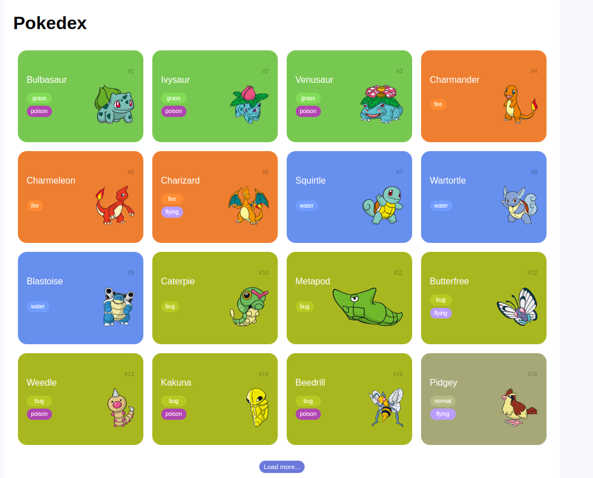
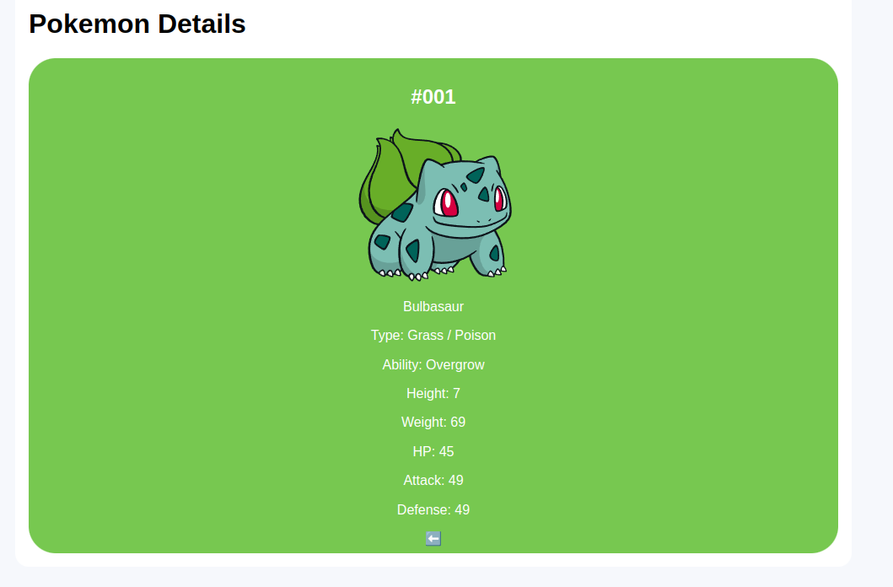

# Pokédex

Uma aplicação simples de Pokédex que lista todos os Pokémon disponíveis através da API [PokéAPI](https://pokeapi.co/api/v2/pokemon?). Ao clicar em cada Pokémon, você pode ver detalhes específicos sobre eles.





## Demonstração

Inserir link para uma demonstração ao vivo ou GIF da aplicação em funcionamento.

## Funcionalidades

- Lista de todos os Pokémon disponíveis.
- Detalhes individuais de cada Pokémon.
- Adicione qualquer outra funcionalidade relevante.

## Pré-requisitos

- Navegador da web moderno que suporte HTML, CSS e JavaScript.

## Instalação

1. Clone este repositório:

```
git clone https://github.com/seu-usuario/pokedex.git

```
2. Navegue até o diretório do projeto:

```
cd pokedex
```

3. Abra o arquivo `index.html` em seu navegador da web.

## Uso

- Ao abrir a aplicação, você verá uma lista de Pokémon.
- Clique em um Pokémon para ver mais detalhes sobre ele.

## API

Este projeto consome a API [PokéAPI](https://pokeapi.co/api/v2/pokemon?) para obter informações sobre os Pokémon. Certifique-se de que a API esteja funcionando e acessível.
